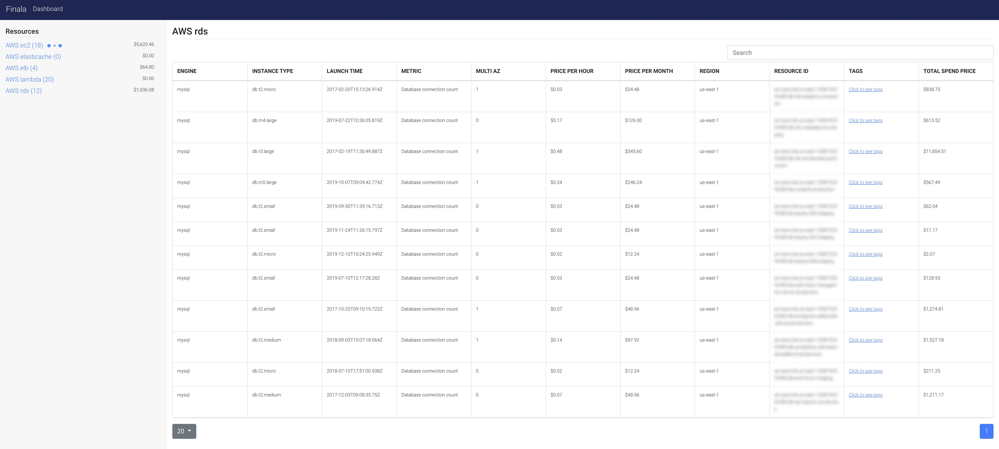

# Finala

[](https://travis-ci.org/similarweb/finala)

A resource cloud scanner that analyzes and reports about wasteful and unused resources to cut unwanted expenses.
The tool is based on yaml definitions (no code), by default configuration OR given yaml file and the report output will be saved in a given storage.

Currently it is implemented for AWS resources (RDS, EC2 instances, DynamoDB, ElasticCache, documentDB, ELB and etc) and can be easily extended.

### Example: Unused RDS report


### Example: Summary of all resources


```
+-------------------------------------------------------------------------------------------------+
| ID           | REGION    | INSTANCE TYPE | MULTI AZ | ENGINE | PRICE PER HOUR | PRICE PER MONTH |
+-------------------------------------------------------------------------------------------------+
| arn:aws:rds: | us-east-1 | db.m3.medium  | true     | mysql  | 0.18           | 129.6           |
| arn:aws:rds: | us-east-1 | db.t2.medium  | false    | mysql  | 0.068          | 48.96           |
+-------------------------------------------------------------------------------------------------+
```

## Getting Started

These instructions will get you a copy of the project up and running on your local machine for development and testing purposes. See deployment for notes on how to deploy the project on a live system.

### How To Use

All the logic is contained inside [config.yaml](./config.yaml). 
1. Setup your Cloud provider (currently AWS only) credentials and accounts you want to analyze. 

```yaml
providers:
  aws:
  - name: <ACCOUNT_NAME>
    # Environment variables will be used in case if these variables are absent
    access_key: <ACCESS_KEY>
    secret_key: <SECRET_KEY>
    session_token: "" # Optional variable, on default this variable not set
    regions:
      - <REGION>
```
2. Let it [run](#Installing)! 

*Optional:* There are defaults but, You can specify your own resources to analyze and change the metrics thresholds.

### For example: 

If you want to test RDS resources that had zero connections in the last week: 

```yaml
rds:
    - description: Database connection count
        metrics:
        - name: DatabaseConnections
            statistic: Sum
        period: 24h 
        start_time: 168h # 24(h) * 7(d) = 168h
        constraint:
        operator: "=="
        value: 0
```

### Prerequisites

1. AWS access key and secret key (with readonly access) 
2. Optional: Docker
3. Browser (for the Dashboard UI)
4. Tested NodeJS V12.13

### Installing

1) Build from source

```shell
$ git clone git@github.com:kaplanelad/finala.git
$ make build
```

To run (with static AWS credentials defined in config.yaml):
```shell
$  ./finala aws -c ${PWD}/config.yaml
```

With environment variables:
```shell
$ export AWS_ACCESS_KEY_ID=...
$ export AWS_SECRET_ACCESS_KEY=...
$ export AWS_SESSION_TOKEN=...
$ export AWS_SECURITY_TOKEN=...

$  ./finala aws -c ${PWD}/config.yaml
```

With [aws-vault](https://github.com/99designs/aws-vault):
```shell
$ aws-vault exec aws-account-profile -- ./finala aws -c ${PWD}/config.yaml
```

With Docker and environment variables (untested):
```shell
$ export AWS_ACCESS_KEY_ID=...
$ export AWS_SECRET_ACCESS_KEY=...
$ export AWS_SESSION_TOKEN=...
$ export AWS_SECURITY_TOKEN=...

$ docker run -it --rm \
  -e AWS_ACCESS_KEY_ID="${AWS_ACCESS_KEY_ID}" \ 
  -e AWS_SECRET_ACCESS_KEY="${AWS_SECRET_ACCESS_KEY}" \
  -e AWS_SESSION_TOKEN="${AWS_SESSION_TOKEN}" \
  -e AWS_SECURITY_TOKEN="${AWS_SECURITY_TOKEN}" \
  -v ${PWD}/config.yaml:config.yaml:ro \
  dockerhub_id/image_name
```

For config [example](./config.yaml)

2) Download the binary
https://github.com/similarweb/finala/releases


### Release New Version

To release a new version run the command: 

```shell
$ make release
```

### Development

To run Finala from the source code run the command:


```shell
$ go run main.go aws -c ./config.yaml
```

To run Finala UI with run the command:

```shell
$ cd ui
$ npm install
$ npm run dev
```

Then browse to: http://127.0.0.1:8081/static/


### Dynamic parameters

By default all the data will save in sqlite in local folder

```
-c, --config string                      config file path
    --disable-clear-storage              Clear storage data
    --disable-ui                         Disable UI dashboard view
-h, --help                               help for finala
    --storage-connection-string string   Storage connection string. Default will be DB.db (default "DB.db")
    --storage-driver string              Storage driver. (Options: mysql,postgres,sqlite3,mssql) (default "sqlite3")
    --ui-port int                        UI port. default 9090 (default 9090)
```


## Running the tests

```
$ make test

$ make test-html
```

## Use-cases:

The full working example can be found in [config.yaml](./config.yaml). 
<hr>

1. Find EC2 instances has less that 5% CPU usage.
```yaml
ec2:
    - description: EC2 CPU utilization 
        metrics:
        - name: CPUUtilization
            statistic: Maximum
        period: 24h 
        start_time: 168h # 24h * 7d
        constraint:
        operator: "<"
        value: 5
```

2. Find RDS DB's that had zero connections in the last week. Maybe we can destroy the DB :)? 

```yaml
rds:
    - description: Database connection count
        metrics: 
        ### Start: Cloudwatch metrics ###
        - name: DatabaseConnections
            statistic: Sum
        period: 24h  
        start_time: 168h # 24h * 7d
        ### End: Cloudwatch metrics ###
        constraint:
        operator: "=="
        value: 0
```

2. Find ELB's that had zero traffic (requests) in the last week. Maybe we can destroy the ELB :)? 

```yaml
elb:
    - description: Loadbalancer requests count
        ### Start: Cloudwatch metrics ###
        metrics:
        - name: RequestCount
            statistic: Sum
        period: 24h 
        start_time: 168h # 24h * 7d 
        ### End: Cloudwatch metrics ###
        constraint:
        operator: "=="
        value: 0   
```

3. Display the actual capacity usage VS the capacity requested (in percentage). 
```yaml
dynamodb:
    - description: Provisioned read capacity units
        ### Start: Cloudwatch metrics ###
        metrics:
        - name: ConsumedReadCapacityUnits
            statistic: Sum
        - name: ProvisionedReadCapacityUnits
            statistic: Sum
        period: 24h 
        start_time: 168h # 24h * 7d
        ### End: Cloudwatch metrics ###
        constraint:
        formula: ConsumedReadCapacityUnits / ProvisionedReadCapacityUnits * 100 # specify any formula 
        operator: "<"
        value: 10
```

## Built With

* [GO](https://golang.org/)
* [AWS SDK](https://aws.amazon.com/tools/) 

## Contributing

All pull requests and issues are more then welcome!
