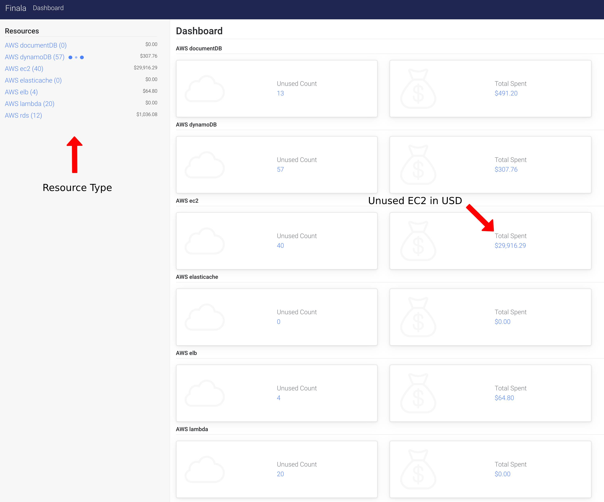

# Finala

[](https://travis-ci.org/similarweb/finala)

A resource cloud scanner that analyzes and reports about wasteful and unused resources to cut unwanted expenses.
The tool is based on yaml definitions (no code), by default configuration OR given yaml file and the report output will be saved in a given storage.

## Supported Services

AWS:
* RDS
* EC2 (ELB, ALB, EBS)
* DynamoDB
* ElasticCache
* DocumentDB

More to come...

## Screenshots

### Unused RDS report


### Summary of all resources



### CLI Format
```
+-------------------------------------------------------------------------------------------------+
| ID           | REGION    | INSTANCE TYPE | MULTI AZ | ENGINE | PRICE PER HOUR | PRICE PER MONTH |
+-------------------------------------------------------------------------------------------------+
| arn:aws:rds: | us-east-1 | db.m3.medium  | true     | mysql  | 0.18           | 129.6           |
| arn:aws:rds: | us-east-1 | db.t2.medium  | false    | mysql  | 0.068          | 48.96           |
+-------------------------------------------------------------------------------------------------+
```

## Getting Started

These instructions will get you a copy of the project up and running on your local machine for development and testing purposes. See deployment for notes on how to deploy the project on a live system.

### How To Use

All the configuration is contained inside [config.yaml](./config.yaml). 
1. Setup your Cloud provider accounts and credentials you would like to analyze. 

```yaml
providers:
  aws:
  - name: <ACCOUNT_NAME>
    # Environment variables will be used in case if these variables are absent
    access_key: <ACCESS_KEY>
    secret_key: <SECRET_KEY>
    session_token: "" # Optional variable, on default this variable not set
    regions:
      - <REGION>
```
2. Let it [run](#Installing)! 

*Note:* We've already implemented some queries to find out which resources are under utilized, feel free to add or change and contribute!

### For example: 

If you want to test RDS resources that had zero connections in the last week: 

```yaml
rds:
    - description: Database connection count
        metrics:
        - name: DatabaseConnections
            statistic: Sum
        period: 24h 
        start_time: 168h # 24(h) * 7(d) = 168h
        constraint:
        operator: "=="
        value: 0
```

You can try and play with the query before in CloudWatch.


### Install & Run

1) Optional: Build from source

```shell
$ git clone git@github.com:similarweb/finala
$ cd finala
$ make build
```

2) Download the binary from https://github.com/similarweb/finala/releases

3) Run it! (make sure to have the config file, you can take the one in this repository)
```shell
$  ./finala aws -c ${PWD}/config.yaml
```

You may use environment variables for AWS access instead of providing them in the config file.
```shell
$ export AWS_ACCESS_KEY_ID=...
$ export AWS_SECRET_ACCESS_KEY=...
$ export AWS_SESSION_TOKEN=...
$ export AWS_SECURITY_TOKEN=...
```

You can even use [aws-vault](https://github.com/99designs/aws-vault):
```shell
$ aws-vault exec aws-account-profile -- ./finala aws -c ${PWD}/config.yaml
```

We suggest taking a look at the [example config](./config.yaml) file to see the available options.


### Release New Version

To release a new version run the command: 

```shell
$ make release
```

### Development

To run Finala from the source code run the command:


```shell
$ go run main.go aws -c ./config.yaml
```

To run Finala UI with run the command:

```shell
$ cd ui
$ npm install
$ npm run dev
```

Browse http://127.0.0.1:8081/static/ and enjoy! (we really appreciate contributes)


### Dynamic parameters

By default all the data will save in sqlite in local folder

```
-c, --config string                      path to the config file
    --clear-storage                      clear the internal storage on startup
    --disable-ui                         disables the ui
-h, --help                               display this help
    --storage-connection-string string   storage connection string. (default "DB.db")
    --storage-driver string              storage driver. (Options: mysql, sqlite3) (default "sqlite3")
    --ui-port int                        UI port. (default 9090)
```


## Running the tests

```
$ make test

$ make test-html
```

## Configuration samples explained:

The full working example can be found in [config.yaml](./config.yaml). 
<hr>

1. Find EC2 instances has less that 5% CPU usage in the last week.
```yaml
ec2:
    - description: EC2 CPU utilization 
        metrics:
        - name: CPUUtilization
            statistic: Maximum
        period: 24h 
        start_time: 168h # 24h * 7d
        constraint:
        operator: "<"
        value: 5
```

2. Find RDS DB's that had zero connections in the last week. 

```yaml
rds:
    - description: Database connection count
        metrics: 
        ### Start: Cloudwatch metrics ###
        - name: DatabaseConnections
            statistic: Sum
        period: 24h  
        start_time: 168h # 24h * 7d
        ### End: Cloudwatch metrics ###
        constraint:
        operator: "=="
        value: 0
```

3. Find ELB's that had zero traffic (requests) in the last week. 

```yaml
elb:
    - description: Loadbalancer requests count
        ### Start: Cloudwatch metrics ###
        metrics:
        - name: RequestCount
            statistic: Sum
        period: 24h 
        start_time: 168h # 24h * 7d 
        ### End: Cloudwatch metrics ###
        constraint:
        operator: "=="
        value: 0   
```
4. Find Application ELB's that had zero traffic (requests) in the last week. 

```yaml
elbv2:
        - description: Application Loadbalancer ActiveConnectionCount
          metrics:
          - name: ActiveConnectionCount
              statistic: Sum
          period: 24h 
          start_time: 168h # 24h * 7d 
          constraint:
          operator: "<"
          value: 20    
```

5. Find a difference of more than 10% between DynamoDB Provisioned RCUs to Consumed RCUs. 
```yaml
dynamodb:
    - description: Provisioned read capacity units
        ### Start: Cloudwatch metrics ###
        metrics:
        - name: ConsumedReadCapacityUnits
            statistic: Sum
        - name: ProvisionedReadCapacityUnits
            statistic: Sum
        period: 24h 
        start_time: 168h # 24h * 7d
        ### End: Cloudwatch metrics ###
        constraint:
        formula: ConsumedReadCapacityUnits / ProvisionedReadCapacityUnits * 100 # specify any formula 
        operator: "<"
        value: 10
```

## Built With

* [GO](https://golang.org/)
* [AWS SDK](https://aws.amazon.com/tools/) 

## Contributing

All pull requests and issues are more then welcome! 
Please see [Contribution guidelines](./CONTRIBUTING.md). 
